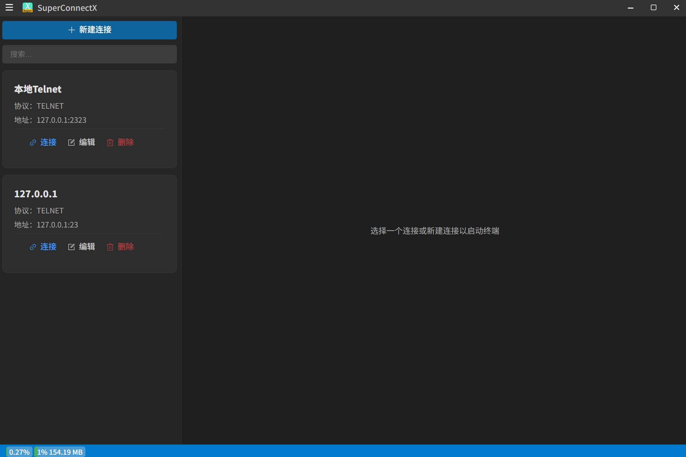

[中文](README.md) [English](README_EN.md) 

<h1 align="center">SuperConnectX</h1>

SuperConnectX is a **super terminal tool** that supports Telnet.

Download：[Here](https://github.com/SuperStudio/SuperConnectX/releases)

