[中文](README.md) [English](README_EN.md) [日本語](README_JP.md)


<h1 align="center">SuperConnectX</h1>

[](#)
[](https://github.com/SuperStudio/SuperConnectX)
[](https://github.com/SuperStudio/SuperConnectX/fork)


SuperConnectXは、COMやTelnetなどの端末接続をサポートする**スーパー端末ツール**で、完全に**Vibe Coding**で開発されています。

ダウンロード：[こちらからダウンロード](https://github.com/SuperStudio/SuperConnectX/releases)

## macOS へのインストールとアップデート

- Apple Silicon Mac（M1/M2/M3/M4 など）では `macos-arm64.dmg`、Intel Mac では `macos-x64.dmg` を選択してください。
- 現在、本プロジェクトは Apple Developer ID による署名と公証を行っていません。ブラウザから初めてダウンロードしてインストールした場合、macOS が「開発元を確認できません」または「アプリが壊れています」と表示することがあります。まず「システム設定 → プライバシーとセキュリティ」でブロックされたアプリを確認し、「このまま開く」を選択してください。
- 「このまま開く」が表示されない場合は、本プロジェクトの Releases から取得したアプリであることを確認し、`SHA256SUMS` を検証した上で、ターミナルから次のコマンドを実行してください。

```bash
xattr -r -d com.apple.quarantine "/Applications/superconnectx.app"
```

- 別の場所にインストールした場合は、実際の `.app` のパスに置き換えてください。`/Applications` 全体ではなく、対象アプリだけを指定してください。
- アプリ内で GitHub Release のメタデータを確認し、現在の CPU アーキテクチャ向けパッケージを判別できます。ただし、macOS の自動インストールには有効なコード署名が必要なため、未署名版では正常完了が保証されません。更新ダイアログの「ダウンロード」から Releases を開き、手動でダウンロードしてアプリを置き換えてください。Gatekeeper に再度ブロックされた場合は、上記の手順を繰り返してください。


# 機能の革新

1. シリアルポート機能は [SuperCom](https://github.com/SuperStudio/SuperCom) から完全に継承

2. Telnet機能に対応

# ソフトウェアの特徴

## シンタックスハイライト

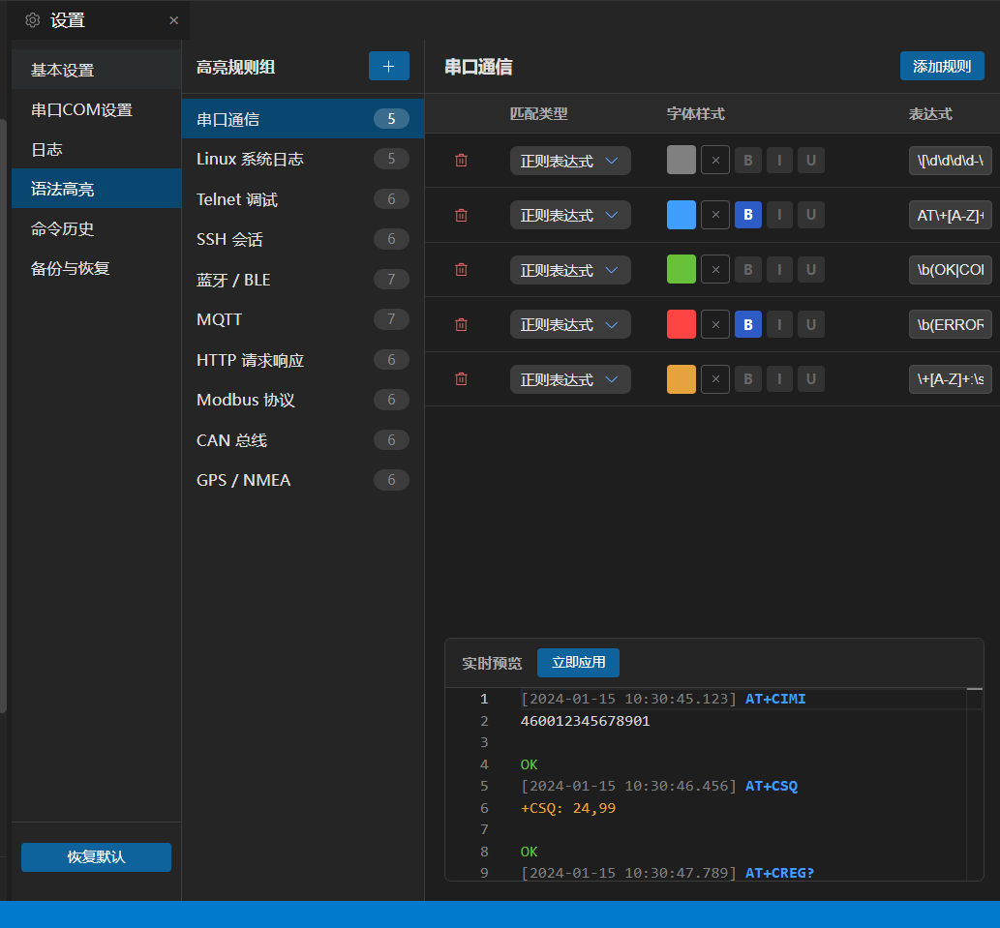


## 画面分割

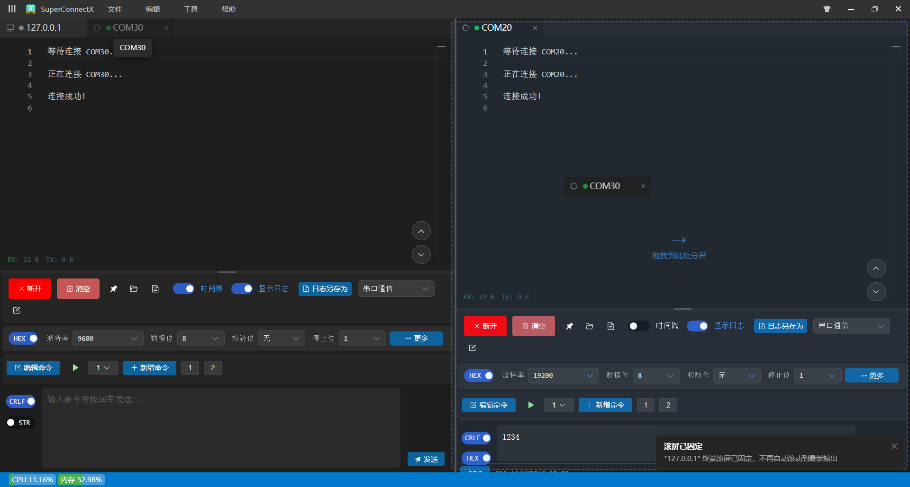

タブのドラッグ＆ドロップに対応

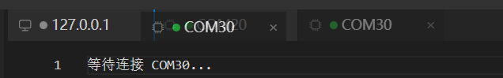

## コマンドエディタ

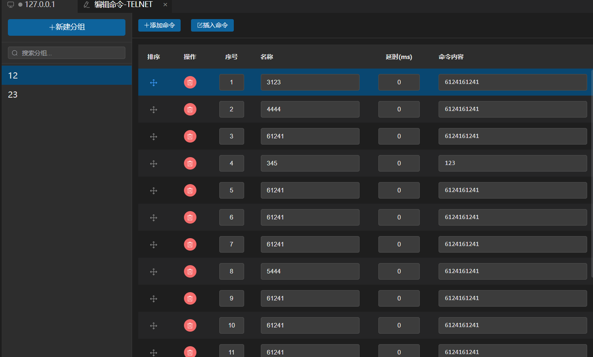

コマンドのループ一括実行

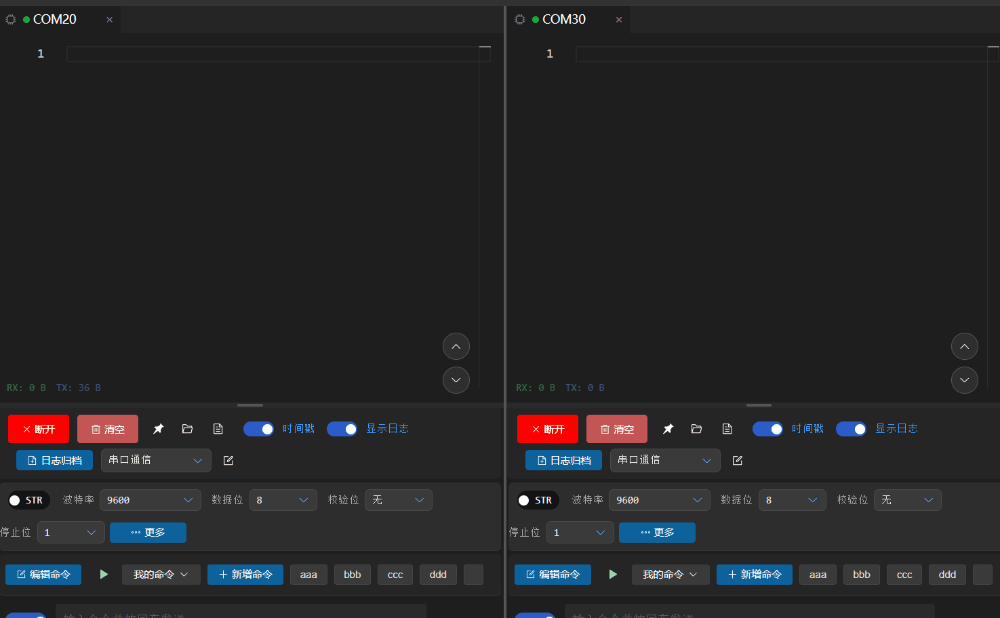


## シリアルCRCチェック

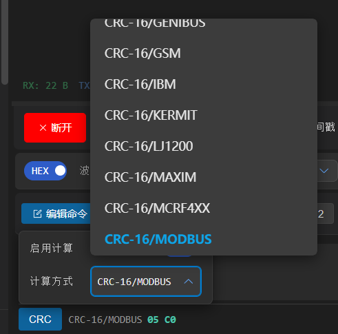

## テーマ - ダーク / ライトモード


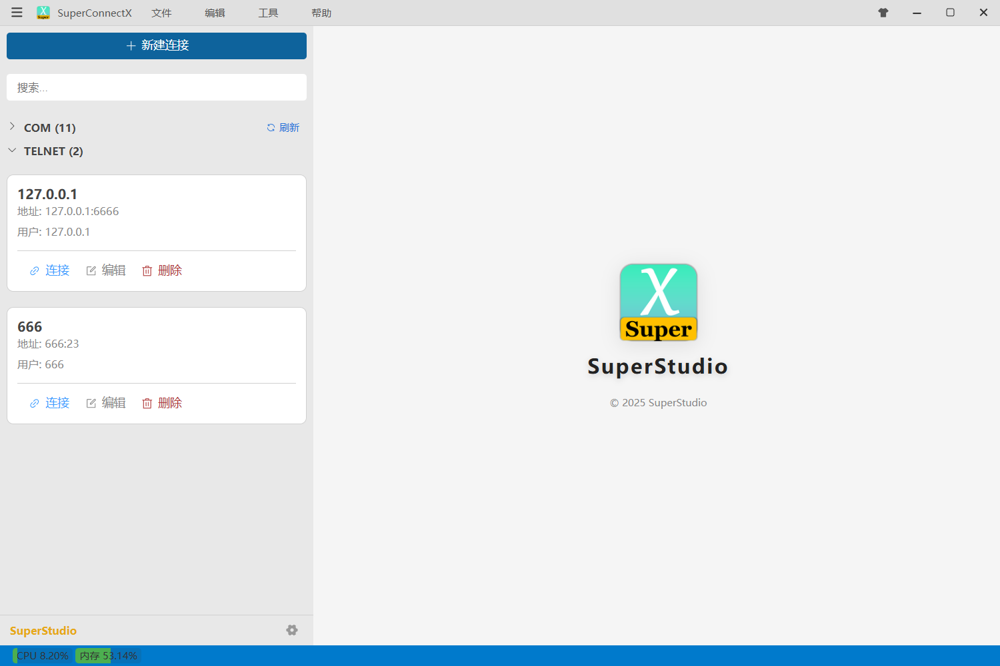

## 複数接続のサポート

COM / Telnet / FTP


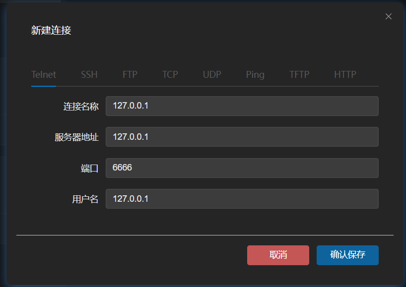

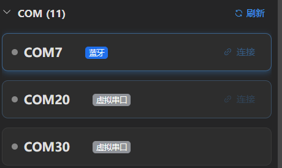

## 仮想シリアルポートエミュレーション

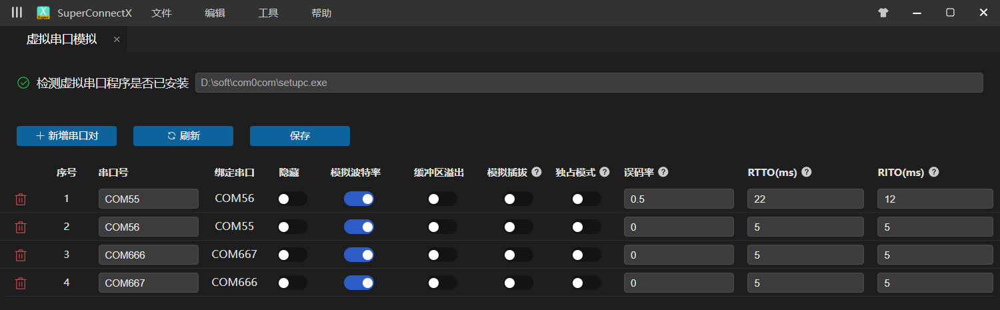

## ショートカットキー


## データのインポート / エクスポート

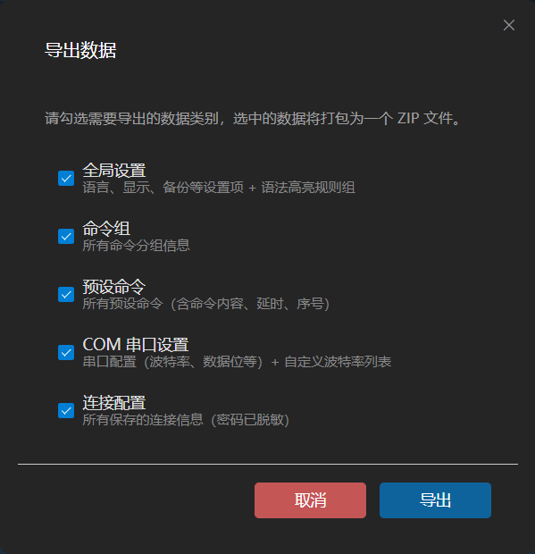

## フォント、折り返しなど

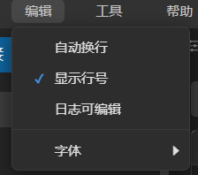


## 自動更新


# 開発方法

## 環境設定

依存関係のインストール

```bash
npm install
```

実行

```bash
npm run dev
```

## 開発への参加

VS CodeでCodeBuddy拡張機能をインストールするか、他のエージェントを使用してVibe Codingを行ってください。


# バージョンリリース

## リリースノートの自動生成

`skills/version-generate.md` の内容をVibe Codingのダイアログに貼り付けてください。

## コードチェック

`npm run typecheck` を実行してください。

## ローカルビルド

`build.bat` を実行してください。

## CI/CD ビルド

`release.bat` を実行すると、GitHub Actionsが自動的に起動し、ビルド完了後に最新のリリースが自動生成されます。


